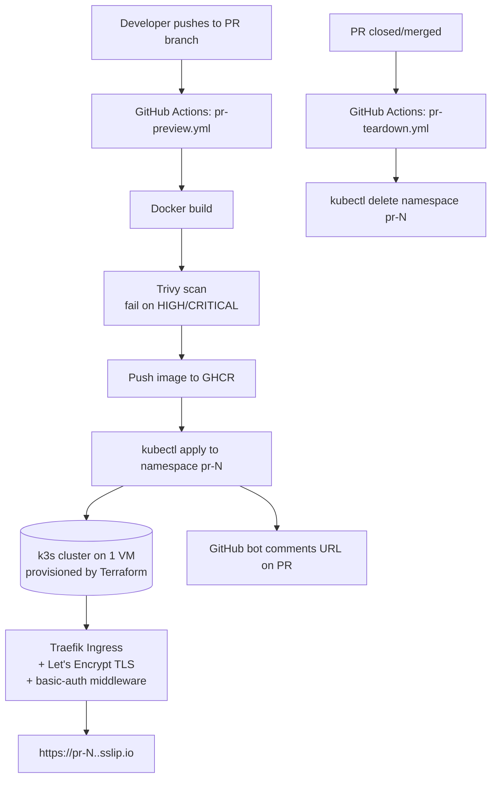

# Architecture

## Diagram

## Components

### 1. Terraform (`/terraform`)
Provisions exactly one VM on DigitalOcean (Droplet) and runs a bootstrap script that installs k3s via its standard install script. Outputs the VM's public IP for DNS configuration, which we then use to determine the target `.sslip.io` domain. State can be local for this project (a remote backend is out of scope, but note it as a "next step" in the README).

### 2. Cluster (k3s, single node)
Everything runs on one node. Namespaces are the isolation boundary between PRs, not separate VMs. Traefik ships with k3s by default and handles ingress + TLS termination.

### 3. Demo app (`/demo-app`)
Trivial by design — its only job is to prove the pipeline. A single static page or one-endpoint API returning something like the PR number and a timestamp is sufficient. It must be stateless (no database, no persistent volume).

### 4. CI/CD (`.github/workflows/`)
Two workflows:
- `pr-preview.yml` — triggers on `pull_request: [opened, synchronize, reopened]`. Builds → scans → pushes → applies Kubernetes manifests templated with the PR number → comments the URL.
- `pr-teardown.yml` — triggers on `pull_request: [closed]`. Deletes the `pr-<number>` namespace, which cascades to delete everything inside it (pods, services, ingress, secrets).

### 5. Kubernetes manifests (`/k8s`)
Templated per PR (namespace, deployment, service, ingress, resourcequota, limitrange, basic-auth middleware reference). Namespace name = `pr-<number>` so resources never collide across concurrent PRs.

### 6. DNS
We use `sslip.io` for wildcard DNS resolving without configuration. The wildcard domain `*.<VM-IP>.sslip.io` automatically resolves to the VM's public IP. Traefik routes by hostname, so no per-PR custom DNS configuration is ever needed — this is what keeps the pipeline fast.

## Request flow (happy path)
1. Developer pushes commits to a PR branch.
2. `pr-preview.yml` fires, builds and scans the image, pushes to GHCR under a PR-specific tag.
3. Workflow templates the Kubernetes manifests with the PR number and applies them.
4. Traefik picks up the new Ingress rule for `pr-<number>.<VM-IP>.sslip.io`.
5. Workflow posts/updates a PR comment with the URL and basic-auth credentials hint (not the actual password — see Security doc).
6. Reviewer opens the URL, authenticates once, reviews the change live.
7. PR is closed or merged → `pr-teardown.yml` deletes the namespace → resources freed, cost stops accruing.

## Known limitations (state these explicitly in the README — they're a feature, not a weakness)
- Single node = single point of failure; acceptable for a portfolio project, not for production.
- No autoscaling; if too many PRs are open simultaneously, quotas may need manual tuning.
- Local Terraform state (no remote backend/locking) — fine for a solo project, called out as a scale limitation.
- Shared basic-auth credential across all previews rather than per-PR credentials — a deliberate simplicity trade-off.
